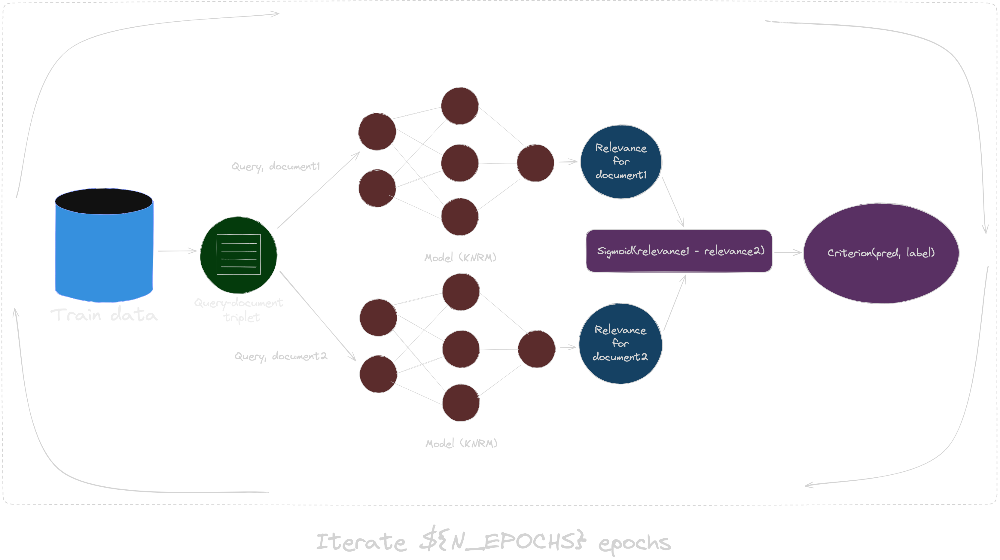
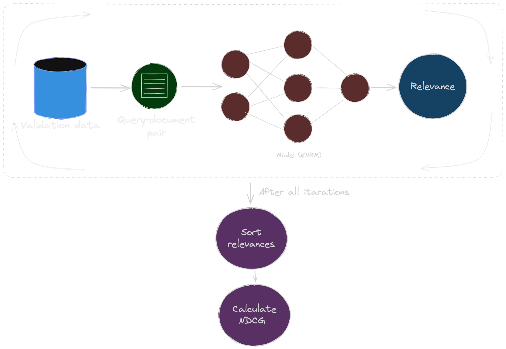

# QA Search System

---

## Overview

QA Search is a Question-Answer search system designed to elevate your search experience using techniques in Learning to Rank (LTR) with KNRM model. This system goes beyond traditional search methods, combining the power of machine learning with specialized natural language processing to deliver highly relevant and context-aware results

---

## System

- **Indexes:** The Indexes service forms the backbone of QASearch, managing and organizing the vast repository of question-answer pairs

- **Gateway:** The Gateway service serves as the entry point for user queries, orchestrating communication between different services

- **Ranker:** The Ranker service leverages KNRM model to prioritize search results

- **Embedder:** The Embedder service is responsible for create vectorized samples, using use-large model from tf-serving 

- **Service Registry** The Service Registry, powered by Redis, acts as a dynamic catalog of index services


---

## Setting up

Follow these steps to set up QASearch on your system

### Exporting Parameters

Export the required parameters for QASearch. Change a file named `env.env` in the project root directory and populate it with the necessary information

```bash
# Parameters
REGISTRY=0.0.0.0:1111 # host:port of your docker registry

REDIS_HOST=0.0.0.0 # past your redis host
REDIS_PORT=1111 # past your redis port
REDIS_PASSWORD=pass # past your redis port

HOSTS="0.0.0.0;1.1.1.1" # past all host you wan to deploy your app in. Use the format "host;host1"
MANAGER_HOST="0.0.0.0" # past your swarm manager host
```

Run the following command in the project root directory:

```bash
export $(cat env.env)
```

### Data preparation
Prepare your question-answer indexes. Follow the steps below to organize your data and run the necessary scripts.

- Paste your question-answer dataset files into the `./data` folder of your QASearch project. Ensure that your dataset is in a suitable format. 
Structure in the `./data` folder:

```plaintext
./data
├── clusters_centers_use_dg{DATA_GENERATION}.pkl
├── clusters_use_dg{DATA_GENERATION}.json
├── use_embeddings_dg{DATA_GENERATION}.pkl
```

- Run the data preparation script from the root directory:

```bash
sudo bash utils/prepare_data.sh DATA_GENERATION
```

### Docker Swarm configure

To configure the Docker Swarm, run this command from the root directory:

```bash
bash utils/swarm_configure.sh
```

This script checks whether Docker Swarm is already initialized. If not, it initializes the Swarm using the specified HOST and MANAGER_HOST variables

### Building project

To build the project, run this command from the root directory:

```bash
bash utils/build.sh
```

This script checks whether a Docker registry exists. If not, it creates the Docker registry, builds the images and pushes all the images to the registry

### Indexes deployment

To deploy indexes, run this command from the root directory:

```bash
bash utils/deploy_indexes.sh DATA_GENERATION
```

This script facilitates the setup of a indexes services, starting with the initialization of a Redis registry based on specified environment variables (`REDIS_HOST`, `REDIS_PASSWORD`, `REDIS_PORT`). It further creates Docker Swarm services for each cluster, taking the specified `DATA_GENERATION` parameter

### Deployment of remaining services

To deploy remaining services, run this command from the root directory:

```bash
bash utils/deploy.sh
```

This script automates the deployment of `ranker`, `embedder`, and `gateway` services, allowing you to easily configure the deployment through environment variables (`HOSTS`, `REDIS_HOST`, `REDIS_PASSWORD`, `REDIS_PORT`)

---

## Indexes update

- Before updating indexes, it's essential to prepare the next data generation. Follow the steps outlined in the Data Preparation section
- To update indexes, run this command from the root directory:

```bash
bash utils/update_indexes.sh DATA_GENERATION
```

### Indexes update workflow

- **Detection of Running Services:**
The script identifies running QASearch index services within the Docker Swarm.
- **Service Update:**
For each discovered service, the script constructs an updated service name `(updated_service_name)` based on the `cluster number` and `DATA_GENERATION`.
It checks if the updated service already exists. If it does, it indicates that the service is running. If not, it proceeds to create the updated service.
- **Service Creation and Cleanup:**
A new service with the updated name is created using the specified environment variables.
The old service is removed `(docker service rm "$service")`, and the corresponding entry in Redis is deleted.
- **Completion Message:**
Once all services are updated you can see the message "Done!".

---

## KNRM: architecture, training and validation

### Architecture

- **Query:**
A user's request for information
- **Document:**
Content returned as a result of a query
- **Translation matrix:**
Captures semantic relationships between query and document terms
- **Kernels:**
Mathematical functions modeling interactions between query and document terms
- **Soft-TF:**
Nuanced term frequency representation considering term importance
- **Features:**
Input variables for machine learning models, e.g., soft-TF, translation matrix values


### Training

The training process for Kernelized Neural Ranking Model `(KNRM)` utilizes a pairwise learning-to-rank loss. The optimization involves backpropagation `(BP)` through the neural network. Starting from the ranking loss, gradients propagate to the learning-to-rank part, updating ranking parameters `(w, b)`. Subsequently, kernels pass gradients to word similarities, and finally to embeddings



### Validation

In `KNRM` validation, triplets aren't used. Instead, relevance is calculated individually for each document. The model computes relevance scores for documents in the validation set separately. The evaluation is then done using metrics like Normalized Discounted Cumulative Gain `(NDCG)`



---

## CI/CD

- **Build QASearch Docker Images:**
Builds Docker images for QASearch services (`ranker`, `embedder`, `gateway`, `indexes`) based on Dockerfiles
- **Execute build and deploy scripts from utils directory:**
Navigates to the utils directory and executes any custom build and deploy scripts
- **Run QASearch Tests:**
Executes tests to ensure the quality and functionality of QASearch services

---

## Contacts

You can find me via telegram. My nickname is `@hexmldev`